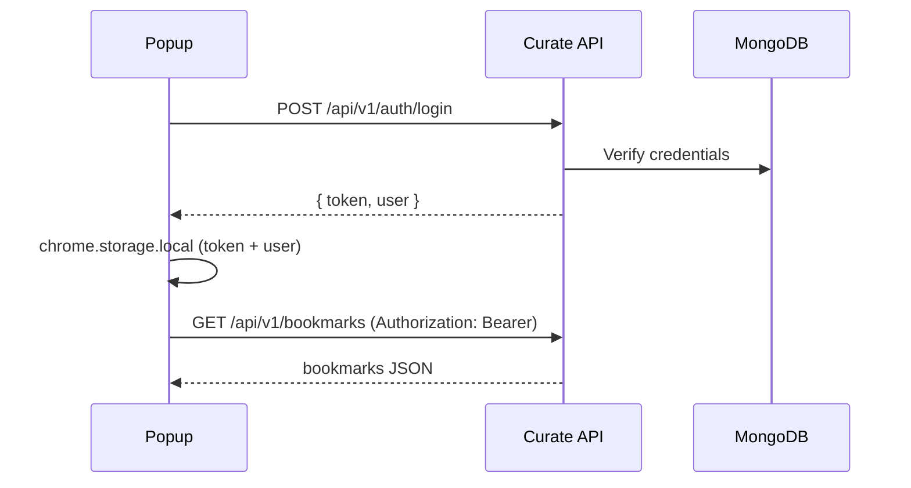

# Curate Extension — Authentication

## Overview

The web app uses **Passport Local + session cookies**. The browser extension uses **Bearer JWT** against `/api/v1` because MV3 popups run on `chrome-extension://` and cannot reliably share the web session cookie.

## Flow

## Token storage

| Item | Location | Notes |
|------|----------|-------|
| JWT | `chrome.storage.local.authToken` | Cleared on logout / 401 |
| User profile | `chrome.storage.local.authUser` | Non-sensitive display fields |

## Server secrets (never in extension)

- `JWT_SECRET` — signs tokens
- `SESSION_SECRET` — web sessions only
- `MONGO_URI` — database

## Expired / invalid tokens

1. API returns `401` with `{ error: "Invalid or expired token" }`.
2. Extension clears local auth via `clearAuth()`.
3. Popup shows the sign-in view.

## Logout

1. Client calls `POST /api/v1/auth/logout` (optional server ack).
2. Client removes token from `chrome.storage.local`.
3. Service worker can clear auth via `CLEAR_AUTH` message.

## Registration

`POST /api/v1/auth/register` mirrors web signup fields:

`username`, `password`, `email`, `firstName`, `lastName`

## Security notes

- Tokens are inspectable if a device is compromised — use HTTPS only in production.
- No refresh-token rotation in v1; tokens expire per `JWT_EXPIRES_IN` (default 7d).
- Password never stored in extension storage.
